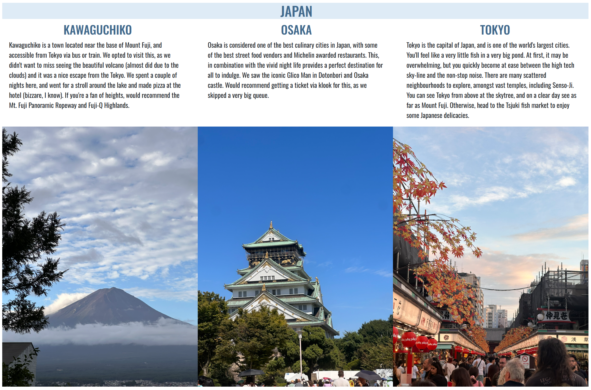
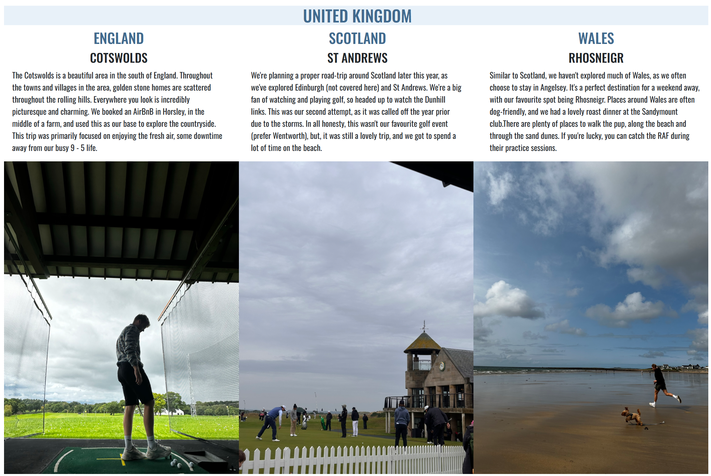
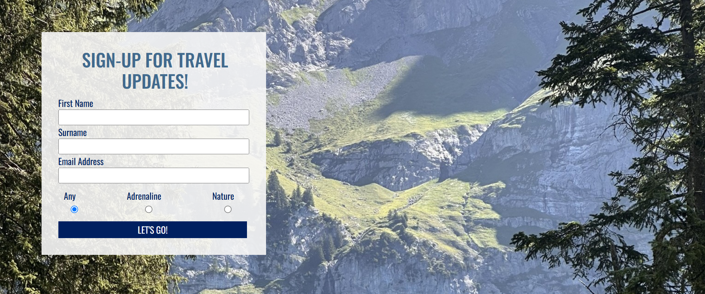
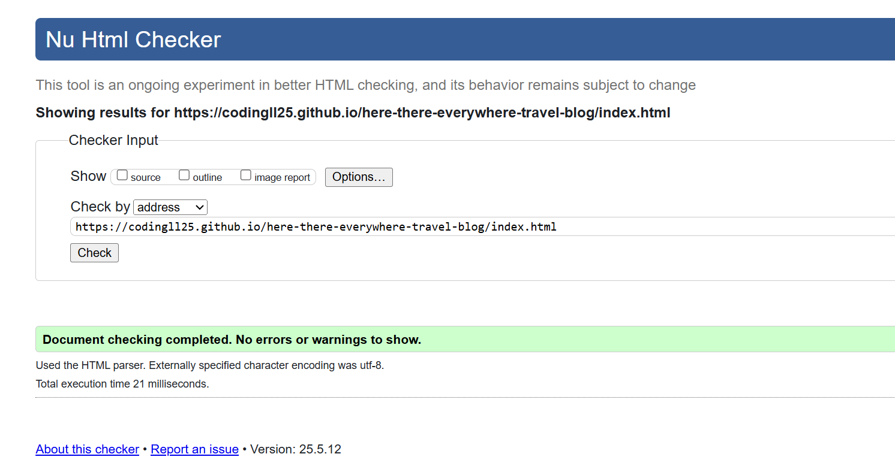
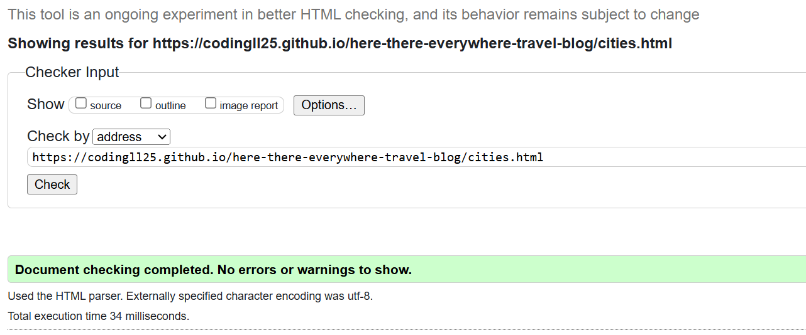
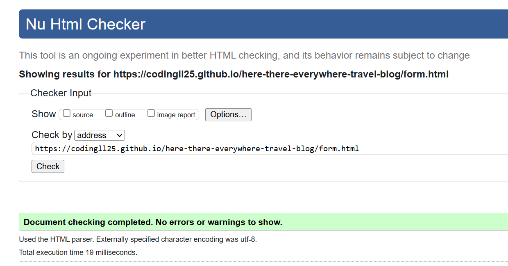
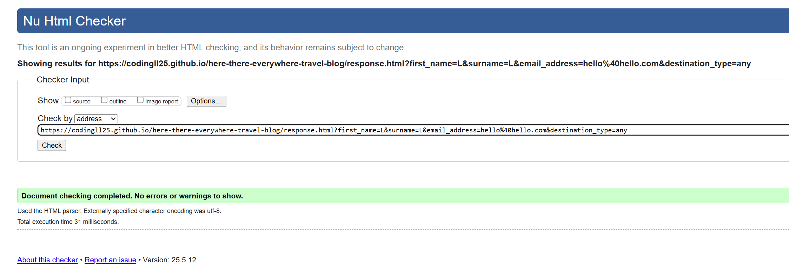

# here-there-everywhere-travel-blog

# here-there-everywhere
Here, There, Everywhere is a site which hopes to inspire others to travel, by providing examples of what's been done to date from a broad lens. The site is targeted to those interesting in traveling, with the aim of being useful to prospect travelers by showing real-world examples of countries or places to visit.

The site can be accessed here: https://codingll25.github.io/here-there-everywhere-travel-blog/index.html

## User Stories
External user's goal: The site's users are interested in traveling, and are looking for inspiration to plan their holiday(s).
Site owner's goal: The goal of the site is to provide ideas and inspiration for those wanted to travel, by summarising experiences to date.

### First Time Vistor Goals:
As a First Time Visitor..
  - I want to easily understand the main purpose of the site, so I can learn more about what it has to offer.
  - I want to be able to easily navigate through the website, so I can find the relevant content to look at.
  - I want to see the example pictures from covered destinations, so I can see whether this aligns with my interests.

### Returning Visitor Goals:
As a Returning Visitor..
  - I want to see information about specific destingations, so that I can learn about each destination for my own travels.
  - I want to find a way to get in contact with the site owner, so that I can ask additional questions or send a request about a particular destinations.
  - I want to find social media links, so that I can stay up to date with any recent travels posted about.

### Frequent Visitor Goals
As a Frequent Visitor..
  - I want to have options for signing up to travel updates, so I know when to look at the site regarding any new destinations

## Features 

- __Home / Cities / Form / Response page: Navigation Bar__
  - Featured on all pages within the site, which is fully responsive based on screensize. Navigation bar remains the same across all pages.
  - This feature links all pages together for ease of access, "Home" leads to the gome page, "Cities" leads to page covering specific cities with the gallery, and "sign-up form" leads to the contact form page, which can be completed so users can receive travel updates

  - __Home / cities page: Cover Image__
    - The home and cities page includes the same photograph from my travels. Both cover image has text overlayed, with the home page including the sites purpose (inspiration) to the user knows the intention of the site. 
    - This section provides an eye-catching photo to draw in the users attention, by providing inspiration on where they could visit

  - __Home page: About this page__
     - This section summarises the intention of the site, in terms of providing highlights from my travels. For country specific tabs, the overview sections contextualises travels to date. 

  - __Home page: What did we get up to__
  - Highlights the  type of activities which could be covered within the site, by emphasising what has been done to date. Helps contexualise the content for the user.

  - __Cities page: overview__
  - Summary of key cities within the countries stated on the home page, including an image from each city for context. Describes specific things to do within each city, alongside highlights from my trips.

  - __Home / Cities / Form / Response page: Footer / Socials__
    - The footer section remains the same across each page,and includes a link to my email and instragram account (opens in a different tab for ease of use)
    - This feature allows the user to reach out if they have any questions, or explore additional countries not covered within the site freely.

  - __Sign-up page: form__
    - Form created so users can sign-up for travel updates. All text inputs are customied and labelled, and require an answer to be submitted.  
    - The submit page leads to the response page

  - __Response page: thank you messagee__
    - Response page appears after submitting the contact form.
    - Contains the thank you message

## Technologies used
- [HTML](https://developer.mozilla.org/en-US/docs/Web/HTML) was used to develop the foundation of the site.
- [CSS](https://developer.mozilla.org/en-US/docs/Web/css) - was used to add the styles and layout of the site.
- [CSS roots](https://developer.mozilla.org/en-US/docs/Web/CSS/:root) was used to declare global CSS variables and apply them throughout the project. 
- [VSCode](https://code.visualstudio.com/) was used as the main tool to write and edit code.
- [Git](https://git-scm.com/) was used for the version control of the website.
- [GitHub](https://github.com/) was used to host the code of the website.
- [BootStrap](https://getbootstrap.com/docs/5.3/getting-started/introduction/) was used for the navigation bar.
- [favicon.io](https://favicon.io/emoji-favicons/world-map) was used to generate the site favicon.
- [Font Awesome](https://fontawesome.com/) was used to generate the fonts for the site.

## Design

### Colour Scheme
- Light Blue Colour was used as a background colour since this color creates a sense of tranquility, and links to the key colours shown in the gallery images (dark blues / light blues to represent the sky or the sea)

- Dark Blue Colour was used for specific headings to provide a contrasting colour to the white space, and to draw the users eye to the detail. Dark blue used as a complimentary, contrasting colour to the light blue colour utilised throughout.

- Pink Colour was used to highlight when the user was hovering over specific links or inputs.

### Typography

- Oswald Font was used as the main font of the website in order to increase readability of the content within the site. 

## Testing

### Validator Testing 
- HTML:  No errors were returned when passing through the official [W3C validator]

- CSS: No errors were found when passing through the official [(Jigsaw) validator]

## Deployment
- The site was deployed to GitHub pages. The steps to deploy are as follows: 
  - In the GitHub repository, navigate to the Settings tab 
  - From the source section drop-down menu, select the Main Branch
  - Once the main branch has been selected, the page will be automatically refreshed with a detailed ribbon display to indicate the successful deployment. 

## Credits 
Inspiration taken from learnings to date for the full stack diploma from the code instituite, namely their walkthrough projects (boardwalk games and love running). 
- Home page cards and navigation taken from [BootStrap](https://getbootstrap.com/docs/5.3/getting-started/introduction/)
- Here, There, Everywhere favicon taken from [favicon.io](https://favicon.io/emoji-favicons/world-map)
- Social media / contact icons in the footer were taken from [Font Awesome](https://fontawesome.com/)
- Media images taken personally (no sources used)
